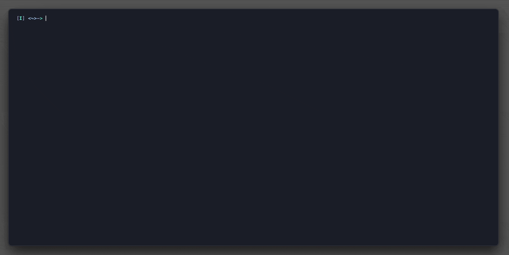

# terminal

[](https://github.com/gleich/terminal/actions/workflows/deploy.yml)
[](https://github.com/gleich/terminal/actions/workflows/build.yml)
[](https://github.com/gleich/terminal/actions/workflows/lint.yml)
[](https://goreportcard.com/report/go.mattglei.ch/terminal)



terminal version of my [website](https://mattglei.ch). Access via the following terminal command:

```bash
ssh terminal.mattglei.ch
```
